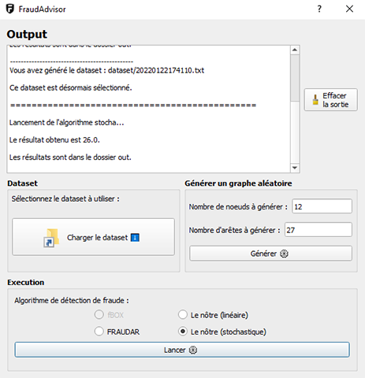

# FraudAdvisor

Stochastic programming project - Polytech ET5 IT - Noted for S9 (2021-2022)



## Asked work

- [Working guide for the project](./doc/[FRENCH]_Fraud_Detection_Polytech_Project.pdf) :fr:

All remaining bugs are listed [here](https://github.com/adepreis/FraudAdvisor/issues).

## Getting Started

These instructions will get you a copy of the project up and running on your local machine for development purpose.

### Prerequisites

Things you need to install the project :

- [Python 3](https://www.python.org/downloads)
	- [cplex](https://pypi.org/project/cplex) library
	- [MarkovSc's fraudar](https://github.com/MarkovSc/fraudar) forked library
		- `pip3 install git+https://github.com/MarkovSc/fraudar.git@master`
	- [PyQt5](https://pypi.org/project/PyQt5) library
	- [pandas](https://pypi.org/project/pandas) library

### Running

Here are some instructions on how to get the development env running.

First, clone this repository with the following command :

	$ git clone https://github.com/adepreis/FraudAdvisor.git

Then, after moving into the `/FraudAdvisor` folder just created, you can run the UI using :

```bash
python main.py
```

> Just make sure that MarkovSc's fraudar fork is installed locally to be able to use FRAUDAR algorithm.

---

<!--

### How it works

- Deployment of code retrieved from Git of ~~fBOX (spectral approach)~~ and FRAUDAR algorithms
	- Use of MarkovSc's fraudar fork
- Development of the mathematical model of stochastic optimization provided by our professor
- the graphical interface allows to simulate different datasets to benchmark the solutions

---
-->

### Authors

* **Lucas B.** - @0xWryth
* **Antonin D.** - @adepreis
* **Rémy T.** - @skyreymz
* **TMWilliam V.** - @TMWilliam

---

## Datasets

Course examples (small graphs) can be found in the `/examples` folder, the UI permits to randomly generate graphs but you can also use larger ones such as Amazon or TripAdvisor networks :

<!-- ask the user to download it by itself because of file size -->

#### Amazon

> :warning: **Works with FRAUDAR but too large for our approaches**

Used Amazon dataset can be found under [Stanford Large Network Dataset Collection](https://snap.stanford.edu/data/#amazon) distributed in the framework of the Stanford Network Analysis Platform (SNAP) by Jure Leskovec and Andrej Krevl.

Dataset files should be placed in the `/dataset` folder (don't forget to remove top comments).

#### TripAdvisor

> :construction: **NOT WORKING, not adapted data structure**

The used dataset has been shared by [Stefano Leone](https://www.kaggle.com/stefanoleone992) under _TripAdvisor European restaurants_ [kaggle repository](https://www.kaggle.com/stefanoleone992/tripadvisor-european-restaurants/version/1) under [CC0 license](https://creativecommons.org/publicdomain/zero/1.0/).

You should place its `tripadvisor_european_restaurants.csv` dataset file in the `/dataset` folder.

---

## Documentation

In the `/doc` folder, you can find a brief [report](./doc/[FRENCH]_Project_Report.pdf) that explains the design choices and contains result screenshots.

---

Built with  
